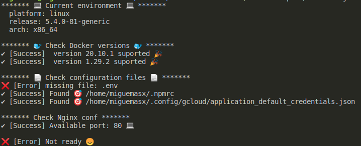

### EnvironmentChecks

Check your environment validating program versions, configuration files, and ports available.


### Check with config file

Example config file:

```yaml
checks:
  - use: version
    run: node -v
    version:
      min: '14'
    name: node
    messages:
      - 'NodeJs'
      - 'Intall version 14'
  - use: npm_auth
```

```
npx environment-checks
```

### Custom validations

You can check this kind of checks:

- version
- available_port

```yaml
checks:
  - use: version
    run: node -v
    version:
      min: '14'
    name: node
    messages:
      - 'NodeJs'
      - 'of Nodejs'
  - use: available_port
    port: 80
    name: nginx
    messages:
      - 'Nginx'
      - 'Close the process on port 80 (lsof -i :80)'
```

### Available validations

- docker: Check min or max docker version
- docker-compose: Check min or max docker-compose version
- npm_auth: Check if exist ~/.npmrc file

```yaml
checks:
  - use: docker
    version:
      min: '20'
  - use: docker-compose
    version:
      min: '1.29.2'
      max: '2.0.0'
  - use: npm_auth
    port: 80
    name: nginx
    messages:
      - 'Nginx'
      - 'Close the process on port 80 (lsof -i :80)'
```
